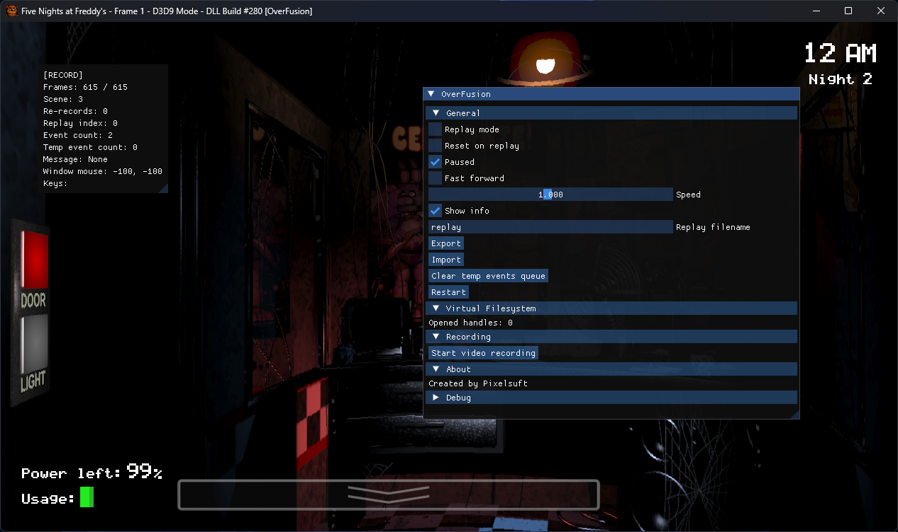
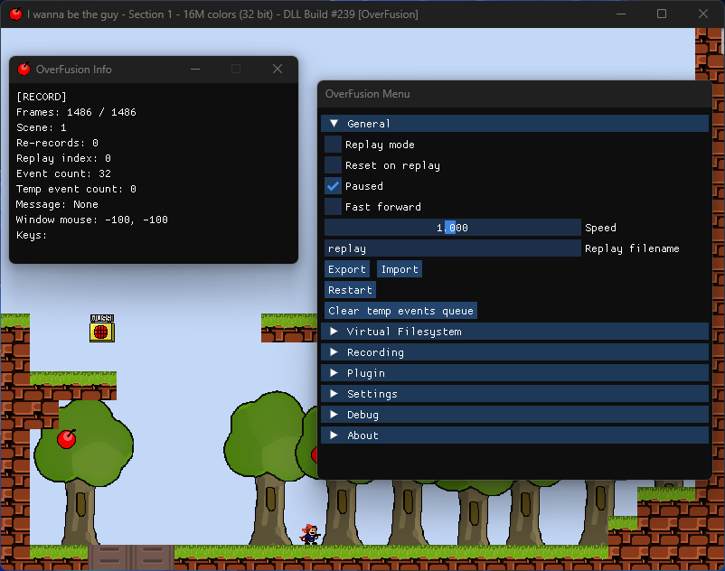

# OverFusion

TAS tool/framework for games based on the MMF2/CTF2.5 runtime

## Screenshots

  

## List of the supported games

- `I Wanna be The Boshy`: PoC, use [boshyst](https://github.com/Pixelsuft/boshyst) instead
- `I Wanna be The Guy`: Very old MMF2 runtime, requires `stdrt.exe` and related stuff unpacking; doesn't support in-game states
- `I Wanna be The Try (1.9.8.3)`: Save states are very broken because of Box2D physics; restarting works strange
- `I Wanna be The Try: A New Adventure (DEMO)`: Same but every frame INI writes are really slow and should be disabled
- `Five Nights at Freddy's`: Works good but not really because of transitions and random strange behaviour after state load
- `Five Nights at Freddy's 3`: Same but starts in fullscreen windowed mode FSR

## Docs

[Building](docs/BUILDING.md)  
[Configuration](docs/CONFIGURATION.md)  
[Usage](docs/USAGE.md)  
[OverFusion Replay format](docs/OFR.md)  
[Capturing](docs/CAPTURING.md)  
[Structure description](docs/SUBSYSTEMS.md)  
[Porting games](docs/PORTING.md)  
