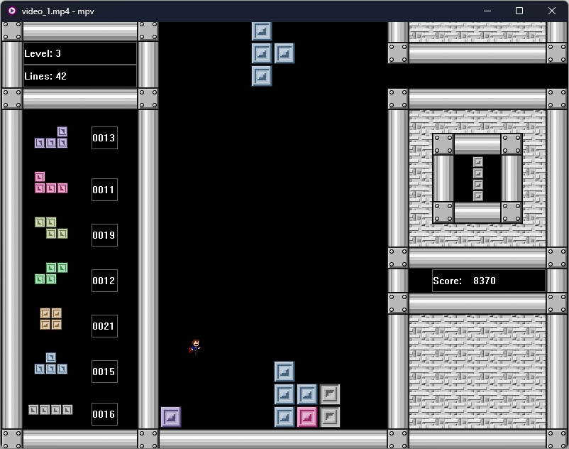
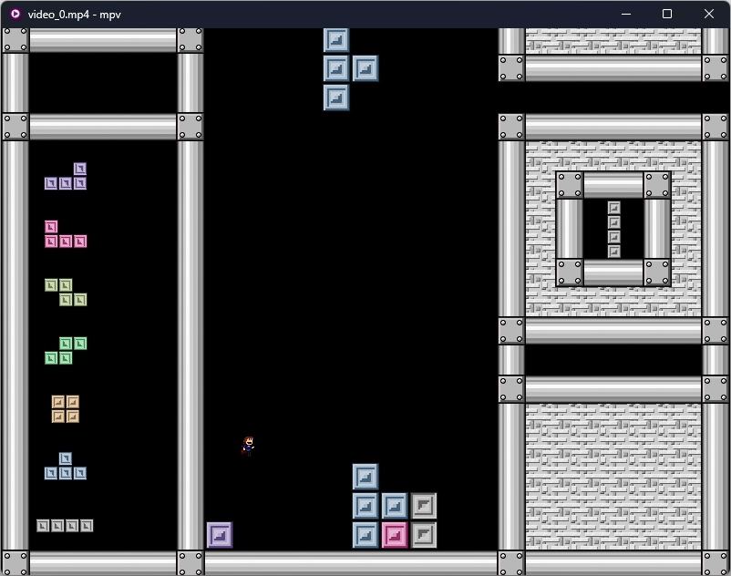
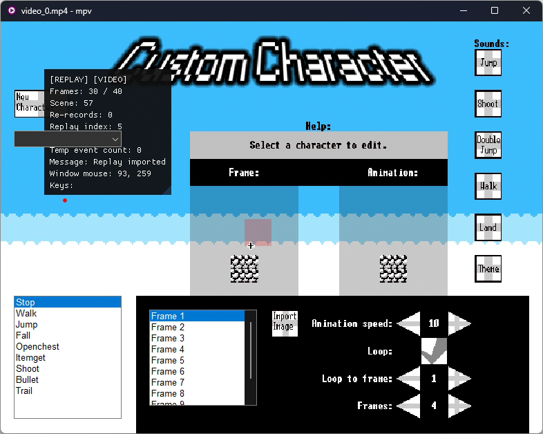
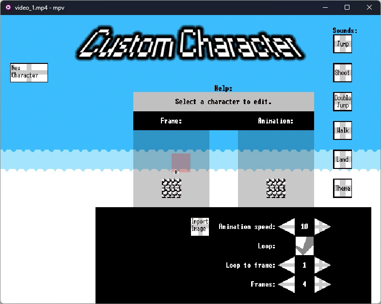

## Requirements

FFmpeg in the PATH variable

## Capturing video

1. Configure `video_cmdline` (note that it uses NVENC codec by default that works only with NVIDIA cards)
2. Start video capture any time inside the `Recording` section of the menu
3. You can see the `[VIDEO]` sign inside the info window
4. Stop video capture
5. Get the video(s) inside the project folder (by default)

### Direct capture

Set `allow_direct_capture` to `true` <br />
By default, the capturing works by taking screenshots of the game window.
Direct capture attemps to make video capturing more direct. If the game uses Direct3D 9, OF will capture it's backbuffer. If the game uses GDI, OF will intercept blit operations to construct the picture of the game. If none of these, it will fall back to the window screenshoting.
Direct capture may be faster and allows to record even outside of the screen area. You can configure `force_resolution` to capture game in 4K even if your monitor has smaller resolution. <br />
Default GDI capture: <br />
 <br />
Direct GDI capture: <br />
 <br />
Default Direct3D 9 capture: <br />
 <br />
Direct Direct3D 9 capture: <br />


## Capturing audio

Unlike video recording, audio recording must be started from the game start. <br />
OF captures every single sound into seperate WAV file, remembers audio events. When recording is stopped, it generates audio filter for FFmpeg to join all files into a single output.

1. Set `record_audio` to `true` (also optionally `support_audio_panning`, beta)
2. Start the game inside the OF
3. You can see the `[AUDIO]` sign inside the info window
4. Play the game at normal speed (no fast forward)
5. Stop audio capture inside the `Recording` section of the menu
6. Now run the `audio_merge.bat` script created in the project folder (configure it optionally)
7. Now you have `audio.wav` audio output

## Joining video and audio

Exmaple command:

```sh
ffmpeg -i video_1.mp4 -i audio.wav -c:v copy -c:a copy merged.mp4
```
