# Extending game support for the OverFusion

If you port game for the first time, I strongly recommend you to try porting already ported game first.

## Requirements

- Ghidra
- Cheat Engine (or any other dynamic analysis tool)
- Some Assembler knowledge

## FNAF3 porting example

In the `plugins` folder, copy `fnaf.cpp` into `fnaf3.cpp` (since there is no template yet, we will just adopt another plugin). Add it to the Visual Studio project inside the `Plugins` section and put it into the jumbo build file `jumbo/main.cpp`. Edit `fnaf3.cpp`: rename `PlugFnaf` class into `PlugFnaf3` (and change `name` variable for the class), `on_plugin_check_fnaf` into `on_plugin_check_fnaf3`, change exe name to `FiveNightsatFreddys3.exe` in it. Comment all memory writes, change all offsets to 0 to not forget to implement something. Change default FPS to your game FPS. <br />
Obtain the game. Create `FNAF3` folder on my drive and put `FiveNightsatFreddys3.exe` into it. Now we need to dump all the plugins. Open `%temp%` folder (cleanup it to make finding easier), run the game, see newly created folder with name like `mrt460C.tmp` or something (inside the temp folder), copy it to our `FNAF3` folder and rename to `dump`, close the game <br />
Now let's create a Ghidra project. Set project dir to our `FNAF3` folder and let's call a project `defnaf3`. Add game exe to it (drag). Then double click on it, start analyzing it, wait. Save the project. <br />
Go to `Symbol Tree`->`Imports`->`COMDLG32.DLL`->`GetSaveFileNameA`/`GetSaveFileNameW`->Right click->`Show References to`. Find a function which uses it, rename it into `ShowStateSaveDialog`. Now find references to `ShowStateSaveDialog` by right clicking on it. You can find a big function which uses it. Rename it into `SaveGameState`. Remember it's offset `48080` and calling conversion `__fastcall`. <br />
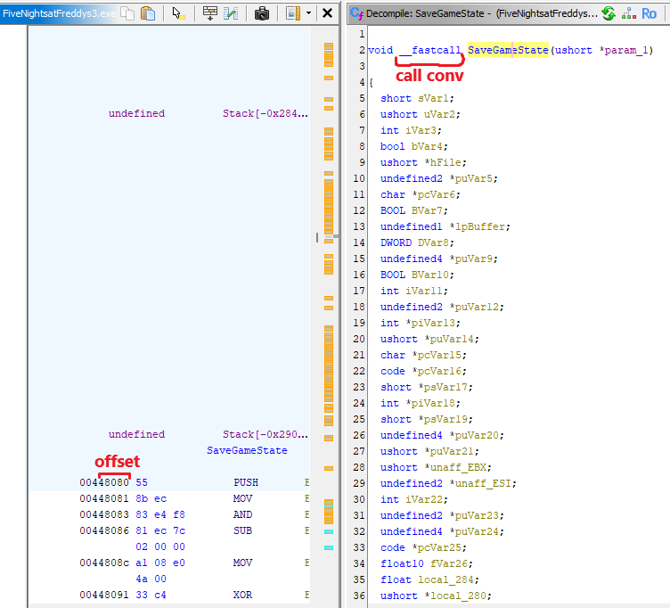 <br />
Let's modify our plugin:

```cpp
void(__fastcall* SaveGameState)(void* hfile);
```

```cpp
SaveGameState = reinterpret_cast<decltype(SaveGameState)>(mem::get_base() + 0x48080);
```

Now do the same for loading a state. Find and rename `ShowStateLoadDialog` function by searching `GetOpenFileName` refs, then find a big (!!!) function which uses `ShowStateLoadDialog` and rename it into `LoadGameState`. Let's modify our plugin again (please keep remembering that I'm porting FNAF3 as an example and every single game (and different game versions) runtime likely has unique offsets):

```cpp
void(__fastcall* LoadGameState)(void* hfile);
```

```cpp
LoadGameState = reinterpret_cast<decltype(LoadGameState)>(mem::get_base() + 0x49c70);
```

Find a function which refs to both `SaveGameState` and `LoadGameState` (using the same `Find References to` tool) and looks like this: <br />
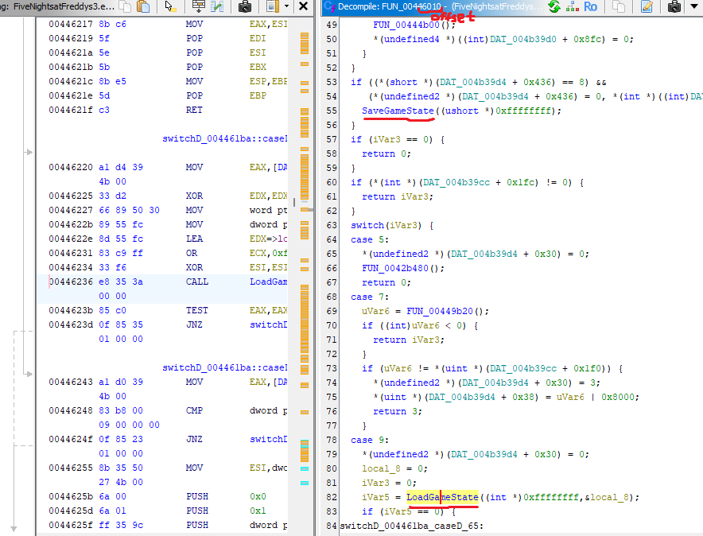 <br />
Rename it into `UpdateGameFrame` and remember offset:

```cpp
cfg.pUpdateGameFrame = reinterpret_cast<void*>(mem::get_base() + 0x46010);
```

Rename red function into `ExecuteEvents` and green into `ExecuteTriggeredEvent`: <br />
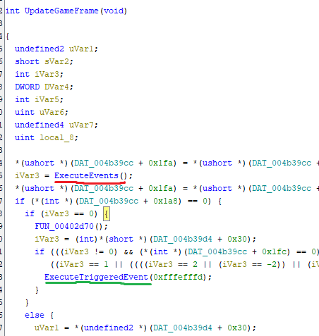 <br />

At the bottom of `ExecuteEvents` rename this function into `RenderFrame` and remember offsets: <br />
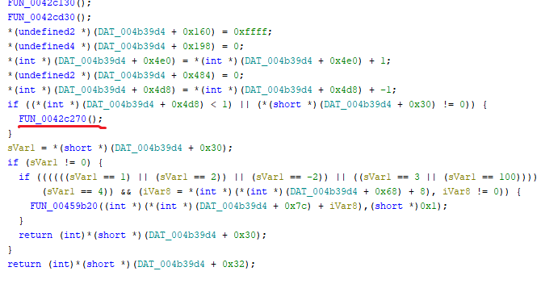

```cpp
cfg.pRenderFrame = reinterpret_cast<void*>(mem::get_base() + 0x2c270);
```

Now find a function which refs to `UpdateGameFrame` and looks like this (uses switch-case): <br />
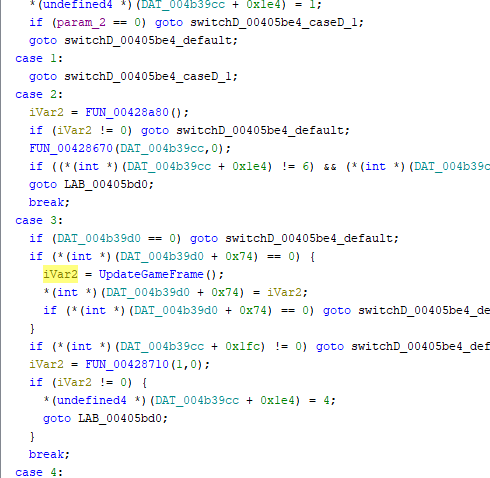 <br />
Rename it into `MainLoopTick`. Now inside this function rename this function into `ProcessTransition` and remember it's offsets: <br />
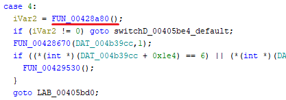

```cpp
cfg.pProcessTransition = reinterpret_cast<void*>(mem::get_base() + 0x28a80);
```

At the bottom of `ProcessTransition` rename this function into `RenderTransition` and remember it's offsets: <br />
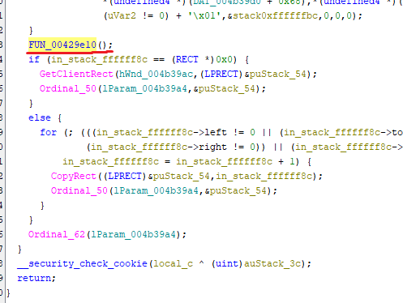

```cpp
cfg.pRenderTransition = reinterpret_cast<void*>(mem::get_base() + 0x29e10);
```

Inside `ExecuteEvents` use `Auto Create Structure` tool on this pointer and rename it into `pState`: <br />
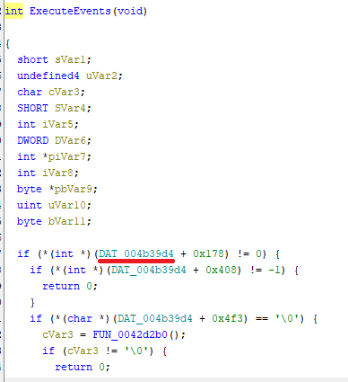 <br />
Check at the top is a pause check (code may look diferent), let's rename this variable (usually `0x178` offset) into `isPaused`: <br />
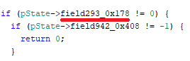 <br />
Double click on `pState` to see it's offset: <br />
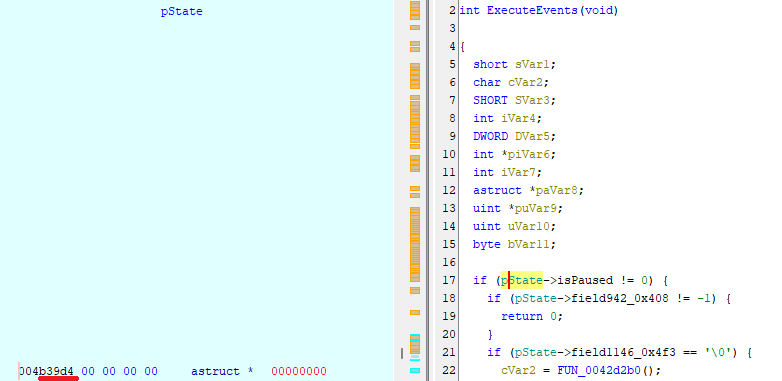

```cpp
case plug::PtrProp::PState:
    return *reinterpret_cast<void**>(mem::get_base() + 0xb39d4);
```

Then use `EditDataType` tool on `isPaused` to see `isPaused` offset: <br />
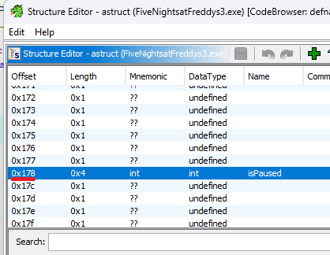

```cpp
case plug::PtrProp::PIsPaused:
    return reinterpret_cast<void*>(reinterpret_cast<size_t>(data) + 0x178);
```

Now slightly scroll `ExecuteEvents`. Rename this into `subTickStep` and remember offset: <br />
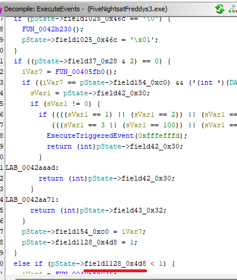

```cpp
case plug::PtrProp::PSubTickStep:
    return reinterpret_cast<void*>(reinterpret_cast<size_t>(data) + 0x4d8);
```

Now inside `case 7` of `UpdateGameFrame` rename red one into `nextFrameTask` and green into `nextFrameData` (use `Auto Fill in Structure` tool on `pState` to fix ugly `uint` cast): <br />
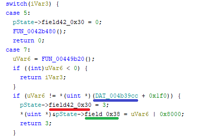 <br />
Seems to be `nextFrameTask` and `nextFrameData` always have the same offsets:

```cpp
case plug::PtrProp::PNextFrameTask:
    return reinterpret_cast<void*>(reinterpret_cast<size_t>(data) + 0x30);
case plug::PtrProp::PNextFrameData:
    return reinterpret_cast<void*>(reinterpret_cast<size_t>(data) + 0x38);
```

Now create a struct called `gApp` from a blue pointer (same screenshot) and remember offset (like with `pState`): <br />

```cpp
case plug::PtrProp::PGlobalApp:
    return *reinterpret_cast<void**>(mem::get_base() + 0xb39cc);
```

Now rename this variable into `sceneID` and remember offset:
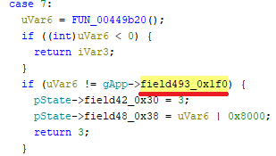 <br />

```cpp
case plug::PtrProp::PSceneID:
    return reinterpret_cast<void*>(reinterpret_cast<size_t>(data) + 0x1f0);
```

Now inside the `case 3` of `MainLoopTick` create a `gStats` struct from this pointer and remember offsets: <br />
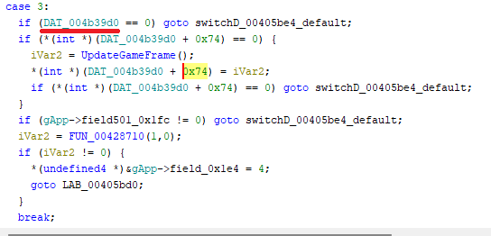

```cpp
case plug::PtrProp::PStats:
    return *reinterpret_cast<void**>(mem::get_base() + 0xb39d0);
```

At this point, the game should at least start under OF (don't forget about configuring OF)!

Let's patch some memory. Find a func which refs `USER32.DLL`->`MsgWaitForMultipleObjects` and looks like this (rename it into `SyncFrameRate`): <br />
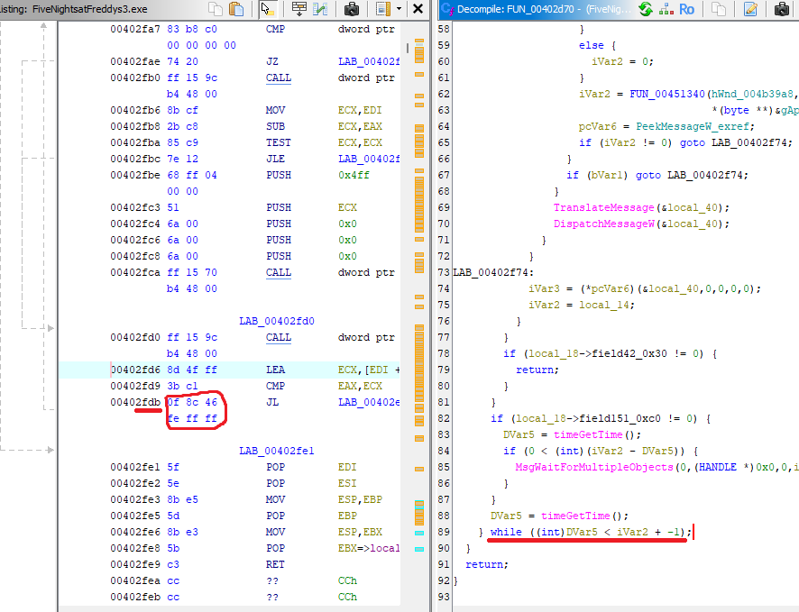 <br />
Firstly, let's patch this `do-while` loop to be executed only once (to avoid softlocks due to time manipulation). Just NOP this jump.

```cpp
mem::write(mem::get_base() + 0x2fdb, {0x90, 0x90, 0x90, 0x90, 0x90, 0x90});
```

Secondly, we need to remove this extra sleeping (just patch the `JZ` to `JMP` to make `if` condition always fail): <br />
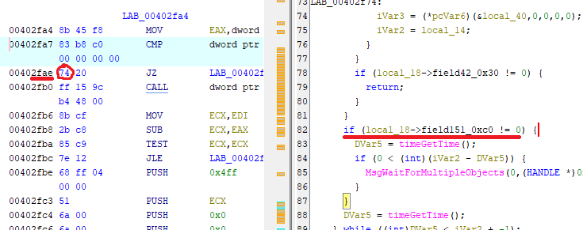 <br />

```cpp
mem::write(mem::get_base() + 0x2fae, {0xeb});
```

Please note that the Fusion runtime usually uses `timeGetTime` as the main time function, but it also may use custom `QueryPerformanceCounter` wrapper function instead as well! <br />

Now let's patch `isPaused` block (inside `ExecuteEvents`) (which might be empty for different runtimes) to not execute any code (just need to patch first `if` jump from `JNZ` into `JMP`): <br />
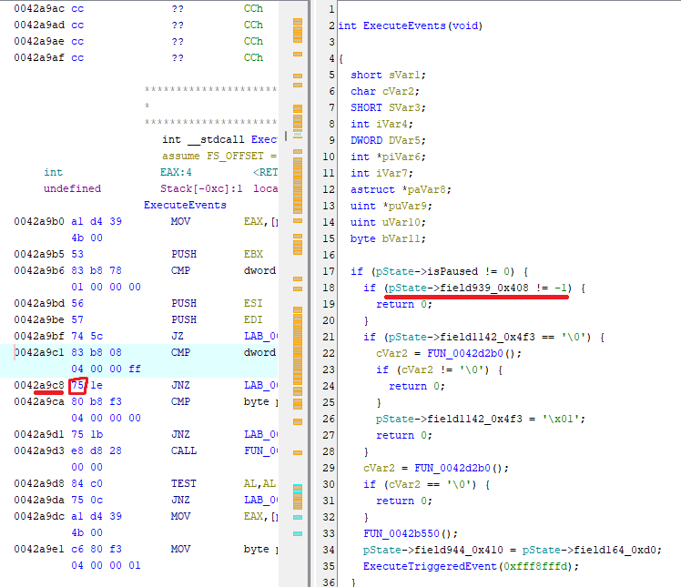

```cpp
mem::write(mem::get_base() + 0x2a9c8, {0xeb});
```

Now we need to patch `ExecuteEvents` to skip this block (to avoid frame skipping): <br />
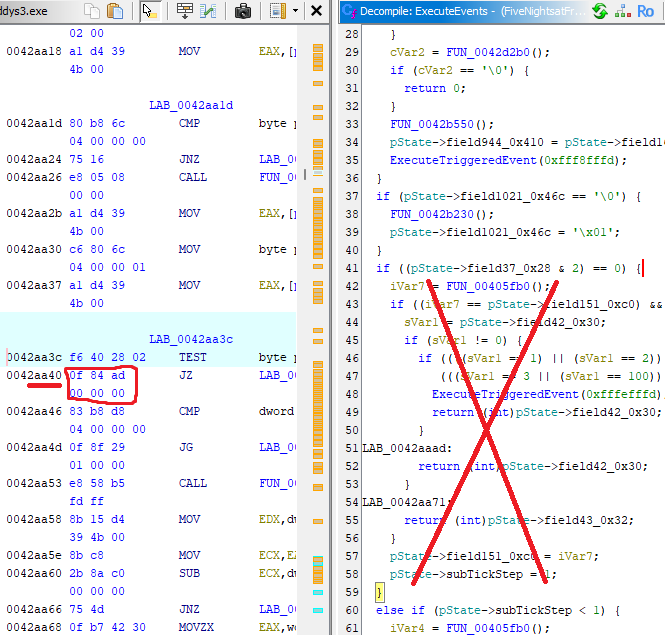

```cpp
mem::write(mem::get_base() + 0x2aa40, {0x90, 0x90, 0x90, 0x90, 0x90, 0x90});
```

Now let's patch setting window title (optional but cool). Search for `USER32.DLL`->`SetWindowText` imports and find a function which looks like this: <br />
 <br />

## TODO

finish this doc (patching transition, other memory patching, timer fix)
