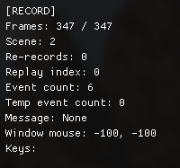
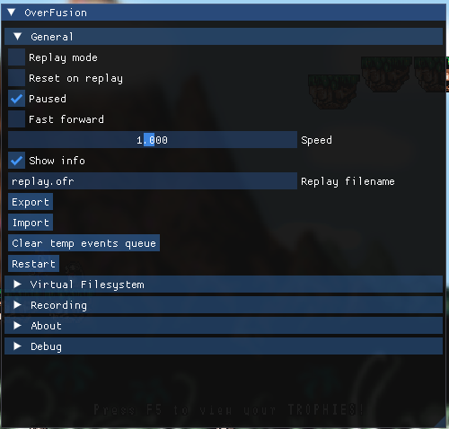

## Running

Use injector to run the game with OverFusion:

```sh
"path-to-the-ofinjector.exe" "path-to-the-game.exe" "path-to-the-overfusion.dll-relative-to-the-game" "project-name-here"
```

## Using OF

See default binds [here](CONFIGURATION.md). <br />
There is an info window which might be useful. It displays playback state (RECORD/REPLAY), frame counter, re-record count, last frame keyboard state and other stuff: <br />
 <br />
By default, game runs in a paused state. You can unpause it or use frame advance. <br />
You can save/load states. Most of the games are not friendly with them (I think there should be other external ways to do that, not only via virtual machine snapshots). <br />
You can use menu switch into replay mode, export or load replay (which are readable and does not keep game state itself): <br />
 <br />
You can switch into replay mode during recording. <br />
If you load state in replay mode, it will act like replay importing. <br />
Note: if you import different replay/state during replay, incompatible with previous, it will likely cause desync. <br />
You can switch from replay mode to recording mode as well without any problems. <br />
